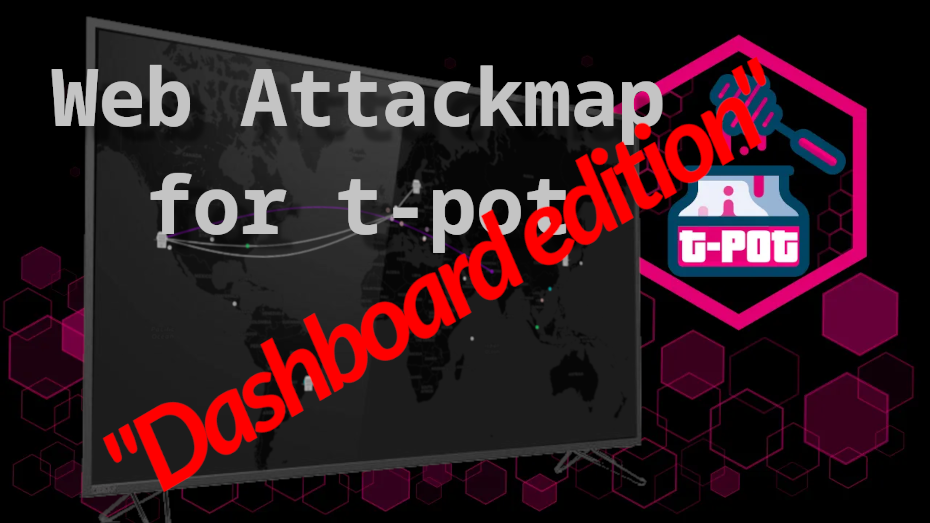
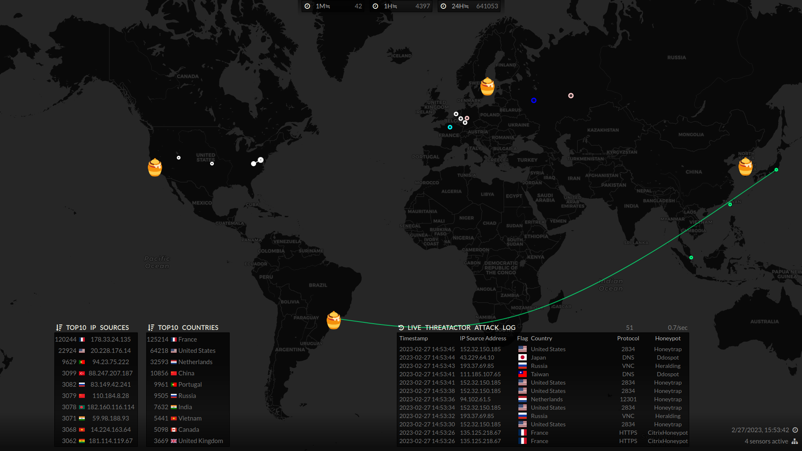
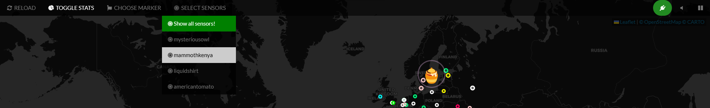

# ᵔᴥᵔ T-Pot CE - Fullscreen Optimized Attack Map

[](https://twitter.com/davidbl) [](https://github.com/kawaiipantsu/tpotce-fullscreen-attackmap/issues) [](https://github.com/kawaiipantsu/tpotce-fullscreen-attackmap/issues) [](https://github.com/kawaiipantsu/tpotce-fullscreen-attackmap/blob/master/LICENSE) [](https://github.com/kawaiipantsu/tpotce-fullscreen-attackmap/network) [](https://github.com/kawaiipantsu/tpotce-fullscreen-attackmap/stargazers)

> The Web Attackmap currently included in [T-Pot CE](https://github.com/telekom-security/tpotce) is not half bad, but it's really not optimized for running 24/7 on a dashboard monitor or big screen tv etc. This is just that. It has been scraped, tuned, optimized for running on big screen TV 24/7 - Perhaps not something most poeple need, but it did! Need that "bling bling" on a Big TV! ʘ‿ʘ

[](https://github.com/telekom-security/tpotce)

## Table of Contents

- [ᵔᴥᵔ T-Pot CE - Fullscreen Optimized Attack Map](#ᵔᴥᵔ-t-pot-ce---fullscreen-optimized-attack-map)
  - [Table of Contents](#table-of-contents)
  - [Why the need?](#why-the-need)
    - [Screenshot](#screenshot)
  - [What changes have i made ?](#what-changes-have-i-made-)
    - [Things removed](#things-removed)
    - [New features](#new-features)
    - [Still on the drawing board](#still-on-the-drawing-board)
  - [Installation](#installation)
    - [Prepare T-Pot map redis](#prepare-t-pot-map-redis)
    - [SSL/TLS Certificate files](#ssltls-certificate-files)
    - [Download files](#download-files)
    - [Configuaration](#configuaration)
    - [Start the attackmap](#start-the-attackmap)
  - [Security](#security)
  - [Credits](#credits)
  - [Licenses / Copyright](#licenses--copyright)

## Why the need?

We all know this - Especially if you work in a SOC or with security in general. A lot of times to help outsiders or the un-initiated to understand how much noise, filth and unwanted traffic and attacks are going on in the universe at all times. It can be a very good and healty experience for them to see what a "live" attack map like this looks like in action.

This is also why i needed a more reliable and customizable version of this attack map. Simply as i needed to be able to showcase this "separately" from my [T-Pot CE](https://github.com/telekom-security/tpotce) installation/host but also as something that needed to run 24/7 on a remote monitor that i would not have to micromanage or hear about breaking :)

### Screenshot

This is what it looks like :)



Here is the menu i'm talking about, still needs some micro adjustments on style/layout but you get the idea. Connection status, Sound and Pause on right side etc.



The menu goes away after 5 sec

## What changes have i made ?

I removed a lot of the functionality that was not needed on the fullscreen setup, as usually there are no peripherals connected to it anyway. Only the first time when you're doing the setup etc. Then i added some cool options that you can enable/disable etc on setup.

### Things removed

The following things was removed from the "original" attackmap (`map_web`).

- Any attempt to make a "update()" function for SVG redraw/3d translation
- Down scaled the max markers and circles allowed on map
- Fixed and locked Zoom
- No movement of map
- Removed all "popup/panes" for circles and markers

### New features

The following new features have been added:

- Pause or Resume attack animations
- Enable or Disable sound effects :)
- Ability to select what sensors you want to show
- Enable or Disable showing statistical information
- Enable or Disable anonymization of Source-IP addresses
- Auto hide menu after 5sec and mouse cursor
- Automatic map zoom level based on monitor resolution
- New markers for "Sensors" - Changeable by menu
- Refresh button (Duuurh, just use F5...)
- Adjusted max "circles" allowed on screen for better longevity
- Data usage saving, when not visible or minimized - Pause websocket
- Connection status indicator
- Error handling for websocket to be better at surviving disconnects
- Error handling for redis for be better at surviving disconnects
- Making sure there are no "mem" leaks or buildups so we can run 24/7

> The sound feature is a bit of a novelty! I highly doubt that it will make much sense unless it's some event/forum where you need to be extra flashy with the attackmap :D None the less i have included it and it's kinda fun to use !

### Still on the drawing board

This is my todo list

- Add a `systemd` service template file for easy implementation
- Over 500 known services vs port added and colors added
- Fix styling issues on menus
- Make IP addresses change color based on IP reputation
- Make Protocol name in Event log be the color of the animation
- Even more new cool features ???

## Installation

Please note that my installation is T-Pot as distributed (hive+sensors) but I also do not use the ISO. All my servers are already populated with Debian 11 so users/info might vary in your case. I have tried to make it fit standard T-Pot settings.

### Prepare T-Pot map redis

First make sure your T-Pot Hive / Standalone installation is running with an exposed `map_redis` port. This is done by adding the following to `tpot.yml` on your T-pot CE Standalone / Hive host

```bash
ssh -i key.pem tsec@hive.ip -p 64295
sudo su -
nano /opt/tpot/etc/tpot.yml
```
> In nano hit `Ctrl^w` and search for `map_redis`  
> Here you need to add the below lines right after `tty: true`

```yaml
ports:
 - "64379:6379"
```
> Now save and restart your installation (Standalone or Hive)  
> Next lest check to see if the port is forwarded correctly!

```bash
ssh -i key.pem tsec@hive.ip -p 64295
sudo /opt/tpot/bin/dps.sh | grep map_redis
map_redis       Up 2 min             0.0.0.0:64379->6379/tcp
```

Now you can reach `map_redis` on your T-Pot Hive/Standalone IP. Please be aware that any of the ports above 64000+ should be restricted!! See [Security](#security) section.

> **WARNING**  
> Now you can reach `map_redis` on your T-Pot Hive/Standalone IP. Please be aware that any of the ports above 64000+ should be restricted!! See [Security](#security) section.

That's why you really should run a distributed solution in order to protect yourself better and have better segmentation on what is management part and what is sensors etc.


### SSL/TLS Certificate files

On the server that is going to host the fullscreen t-pot attackmap.

```bash
sudo su -
apt install certbot
```

Install what ever plugin flavor you use!!  
Here is AWS Route53 etc.

```bash
apt install python3-certbot-dns-route53
mkdir /root/.aws && chmod 700 /root/.aws

cat <<EOF>/root/.aws/credentials
[default]
aws_access_key_id=XXXXXXXXXXXXX
aws_secret_access_key=XXXxxXXXXxXxXxXxXxXX
EOF
```

Finally generate your SSL / TLS certificate files

```bash
certbot certonly --dns-route53 -d mydomain.tld
```

### Download files

On the server that is going to host the fullscreen t-pot attackmap.

```bash
sudo su -
cd /opt
git clone https://github.com/kawaiipantsu/tpotce-fullscreen-attackmap.git
```

Also let's install NodeJS from NodeSource to get 19.x version.
The old outdated NodeJS in Debian 11 is meh!

```bash
sudo su -
curl -fsSL https://deb.nodesource.com/setup_19.x | bash - &&\
apt-get install -y nodejs
```

### Configuaration

Move the `.env.example` file to `.env` and edit it with your Hive IP and Certificate files. Also don't forget to install needed npm apps.

```bash
sudo su -
cd /opt/tpotce-fullscreen-attackmap
mv .env.example .env
nano .env
```

Also edit the file `static/js/websocket-fqdn.js` and change the hostname/fqdn to what ever you created the certificate for this host.

```bash
sudo su -
cd /opt/tpotce-fullscreen-attackmap
nano static/js/websocket.js
```

Download needed NodeJS modules/Extensions

```bash
sudo su -
cd /opt/tpotce-fullscreen-attackmap
npm install
```

### Start the attackmap

You can just start it from command line directly in your ssh/shell like this

```bash
sudo su -
cd /opt/tpotce-fullscreen-attackmap
node main.js

[27-02-2023 16:58:38] info: WebSocket initialized, with zlib compression, concurrency limit = 10
[27-02-2023 16:58:38] info: Redis client initialized
[27-02-2023 16:58:38] warn: Web Attack Map - Web Server (https) & Websocket (wss) starting up
[27-02-2023 16:58:38] warn: Web Attack Map - Now listing for connections on port 443
```

I will add a `systemd` file in the future, this is todo.  
For now i just wanted to get it pushed and out there. But you should absolutely run this via systemd!!

## Security

I want to stress that working with any "honeypot" requires some constrain and firewall rules or protection in place. This goes for any infrastructure. But since i'm utilizing the build in (otherwise) protected `map_redis` container as reachable from outside network this means you will have to protect it.

But you should already have protection in place around your [T-Pot CE](https://github.com/telekom-security/tpotce)t installation. Like only allowing "public" access to the installation on port 1 to 64000. And anthing above that should be considered "management" ports and should only be accessible from your trusted IP sources.

Even better you should use the HIVE / Sensor distributed solution so that you can have the Hive inside your internal network and sensors out in the wild!

## Credits

- [T-Pot CE](https://github.com/telekom-security/tpotce)

This version of [T-Pot CE](https://github.com/telekom-security/tpotce) attack map is the one that have been re-vamped by [Marco Ochse (t3chn0m4g3)](https://github.com/t3chn0m4g3) for the purpose of suiting T-Pot CE and their installation process and data collected by the honeypots.

The original attack map was created by [Matthew Clark May](https://github.com/MatthewClarkMay/geoip-attack-map).  
First T-Pot based fork was released by [Eddie4](https://github.com/eddie4/geoip-attack-map).

## Licenses / Copyright

[Bootstrap](https://getbootstrap.com/docs/4.0/about/license/), [D3](https://github.com/d3/d3/blob/main/LICENSE), [Flagpack](https://github.com/Yummygum/flagpack-core/blob/main/LICENSE), [JQuery](https://jquery.org/license/), [Leaflet](https://github.com/Leaflet/Leaflet/blob/main/LICENSE), [OpenStreetMap](https://www.openstreetmap.org/copyright).
