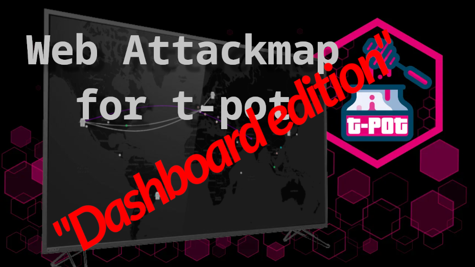

# ᵔᴥᵔ T-Pot CE - Fullscreen Optimized Attack Map

     

> The Web Attackmap currently included in T-Pot CE is not half bad, but it's really not optimized for running 24/7 on a dashboard monitor or big screen tv etc. This is just that. It has been scraped, tuned, optimized for running on big screen TV 24/7 - Perhaps not something most poeple need, but it did! Need that "bling bling" on a Big TV! ʘ‿ʘ

## Table of Contents

- [ᵔᴥᵔ T-Pot CE - Fullscreen Optimized Attack Map](#ᵔᴥᵔ-t-pot-ce---fullscreen-optimized-attack-map)
  - [Table of Contents](#table-of-contents)
  - [Why the need?](#why-the-need)
  - [What changes have i made ?](#what-changes-have-i-made-)
    - [New features](#new-features)
  - [Installation](#installation)
  - [Security](#security)
  - [Credits](#credits)
  - [Licenses / Copyright](#licenses--copyright)

## Why the need?

We all know this - Especially if you work in a SOC or with security in general. A lot of times to help outsiders or the un-initiated to understand how much noise, filth and unwanted traffic and attacks are going on in the universe at all times. It can be a very good and healty experience for them to see what a "live" attack map like this looks like in action.

This is also why i needed a more reliable and customizable version of this attack map. Simply as i needed to be able to showcase this "separately" from my t-pot installation/host but also as something that needed to run 24/7 on a remote monitor that i would not have to mico-mangage or hear about breaking :)

## What changes have i made ?

I have removed some functionality that was no longer needed as this is meant only as a "Big screen" TV/Monitor dashboard fullscreen solution.

But i have also added a few cool new features that makes it easy to setup multiple monitors but with different content even if it's just pointing to the same attackmap url.

All "settings" is stored in cookies on the client so multi monitor setup on same computer might need multiple profiles in your browser etc.

### New features

The following new features have been added:

- Pause or Resume attack animations
- Enable or Disable sound effects :)
- Abillity to select what sensors you want to show
- Enable or Disable showing statistical information
- Enable or Disable anonymization of Source-IP addresses
- Auto hide menu after 5sec and mouse cursor
- Automatic map zoom level based on monitor resolution
- Locked map so it wont move, zoom, change for optimal display experience
- New icons for "Sensors" - Changeable by menu
- Refresh button (Duuurh, just use F5...)
- Over 500 known services vs port added and colors added
- Adjusted max "circles" allowed on screen for better longevity
- Error handling for websocket to be better at surviving disconnects
- Error handling for redis for be better at surviving disconnects
- Making sure there are no "mem" leaks or buildups so we can run 24/7

## Installation

Todo ...

But TL;DR is that i expose map_redis port like `64379:6379` to the internal network so that i can reach it directly from this nodejs solution. So i piggyback on `map_data` and `map_redis` that both works really well.

So in essence this is replacing `map_web`.

## Security

I want to stress that working with any "honeypot" requires some constrain and firewall rules or protection in place. This goes for any infrastructure. But since i'm utilizing the build in (otherwise) protected `map_redis` container as reachable from outside network this means you will have to protect it.

But you should already have protection in place around your T-Pot installation. Like only allowing "public" access to the installation on port 1 to 64000. And anthing above that should be considered "management" ports and should only be accessible from your trusted IP sources.

Even better you should use the HIVE / Sensor distributed solution so that you can have the Hive inside your internal network and sensors out in the wild!

## Credits

This version of T-Pot attack map is the one that have been re-vamped by [Marco Ochse (t3chn0m4g3)](https://github.com/t3chn0m4g3) for the purpose of suiting T-Pot CE and their installation process and data collected by the honeypots.

The original attack map was created by [Matthew Clark May](https://github.com/MatthewClarkMay/geoip-attack-map).  
First T-Pot based fork was released by [Eddie4](https://github.com/eddie4/geoip-attack-map).

## Licenses / Copyright

[Bootstrap](https://getbootstrap.com/docs/4.0/about/license/), [D3](https://github.com/d3/d3/blob/main/LICENSE), [Flagpack](https://github.com/Yummygum/flagpack-core/blob/main/LICENSE), [JQuery](https://jquery.org/license/), [Leaflet](https://github.com/Leaflet/Leaflet/blob/main/LICENSE), [OpenStreetMap](https://www.openstreetmap.org/copyright).
